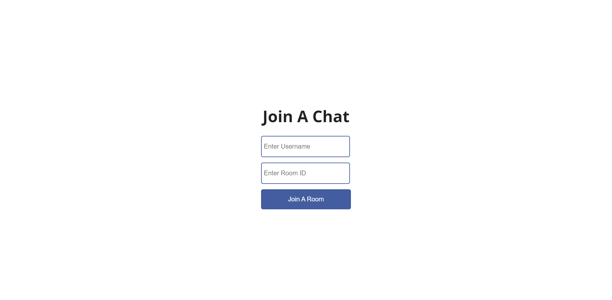

# Chat App

A small project on Chat app made using ReactJS, Socket.io, NodeJS, Html, Css, 

## Tech Stack Used

## Screenshots

Fig 1:- Home Screen For the app.

Fig 2:- 2 clients joining the the same room.

Fig 3:- Clients joined the room successfully  

Fig 4:- Clients messaging Each other.

Fig 5:- Every activity being logged in the server console.

